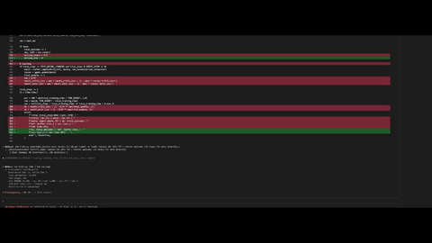
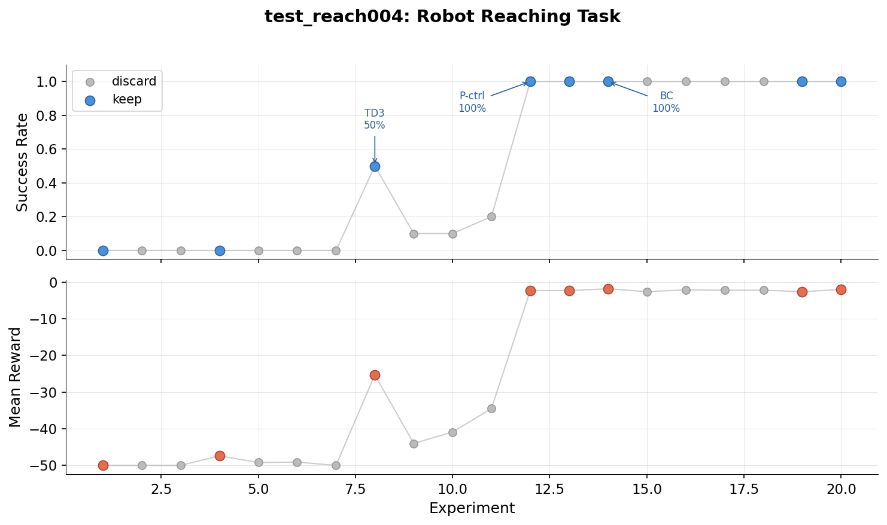

# autoresearch-robotics

Karpathy's [autoresearch](https://github.com/karpathy/autoresearch) adapted for robotics -- autonomous overnight experiment optimization with robotics simulation feedback loop.



## How it works

The repo is deliberately kept small and only really has a few files that matter:

- **`prepare.py`** -- fixed constants, environment factory, observation utilities. Not modified.
- **`evaluate.py`** -- fixed evaluation harness, rendering pipeline. Not modified.
- **`train.py`** -- the single file the agent edits. Contains the full SAC+HER policy, optimizer, and training loop. Everything is fair game: architecture, hyperparameters, RL algorithm, buffer design, etc. **This file is edited and iterated on by the agent**.
- **`program.md`** -- baseline instructions for one agent. Point your agent here and let it go. **This file is edited and iterated on by the human**.

By design, training runs for a **fixed time budget** (wall clock, excluding eval overhead), regardless of the details of your compute. The metric is **eval_success_rate** -- higher is better. Unlike standard LLM training research where the only feedback is a loss curve, robotics has a visual component: the agent analyzes MuJoCo renders of the robot's behavior alongside quantitative metrics. "The arm overshoots and oscillates" is the kind of insight that numbers alone can't give you.

## Quick start

**Requirements:** Python 3.10+, an NVIDIA GPU, [Claude Code](https://docs.anthropic.com/en/docs/claude-code) (or any coding agent).

```bash
git clone https://github.com/jellyheadandrew/autoresearch-robotics.git
cd autoresearch-robotics

# Install uv (if you don't have it)
curl -LsSf https://astral.sh/uv/install.sh | sh

# Install dependencies and verify
uv sync
uv run prepare.py
```

If the above commands all work ok, your setup is working and you can go into autonomous research mode.

### Running the agent

Simply spin up Claude Code (and disable all permissions), then prompt:

```bash
claude --dangerously-skip-permissions
```

```
Hi! Read program.md and let's kick off a new experiment. Start the experiment loop.
# Or, for headless mode (recommended for overnight runs):
Hi! Read program.md and let's kick off a new experiment. Start the experiment loop. Use --headless mode.
```

The agent reads `program.md`, creates a branch, runs the baseline, then loops: analyze → hypothesize → modify `train.py` → commit → train → evaluate (render + visual analysis) → keep/discard → repeat. It runs indefinitely until you Ctrl+C. For overnight runs, use `tmux`.

Monitor from another terminal:

```bash
watch -n 60 'cat results.tsv'
watch -n 30 'git log --oneline -10'
```

The default task is **FetchReach** (10-second time budget, ~30 experiments/hour). For harder tasks or different simulators, see the next section.

## Different tasks

Want to try a harder task? Use `setup_task.py` to create a separate experiment directory:

```bash
# List available templates
python setup_task.py --list

# Set up an experiment directory
python setup_task.py mujoco/fetchpush my_experiment
# or: python setup_task.py mujoco/fetchpickplace my_experiment
# or: python setup_task.py isaac/fetchreach my_experiment

cd my_experiment
git init && git add -A && git commit -m "init"
uv sync
uv run prepare.py
claude --dangerously-skip-permissions
```

### Available tasks

| Template | Task | Time budget | Experiments/hour |
|----------|------|-------------|------------------|
| `mujoco/fetchreach` | Reach a target position | 10 seconds | ~30 |
| `mujoco/fetchpush` | Push a cube to a goal | 10 minutes | ~5 |
| `mujoco/fetchpickplace` | Pick and place an object | 30 minutes | ~2 |
| `isaac/fetchreach` | Reach (Isaac Sim) | 60 seconds | prototype |

## Custom program.md

The `program.md` file is essentially a super lightweight "skill" -- it tells the agent how to run experiments. You can write your own:

```bash
# Option A: replace program.md in the repo root
cp my_custom_program.md program.md

# Option B: use --program with setup_task.py
python setup_task.py mujoco/fetchpush my_experiment --program my_custom_program.md
```

## Results

**FetchReach:**



**FetchPush, FetchPickPlace**: TBD Soon.

**VLA Experiments**: TBD after getting compute credits. (Support would be appreciated! [buymeacoffee.com/jellyheadandrew](https://buymeacoffee.com/jellyheadandrew))

## What changed from the original

[autoresearch](https://github.com/karpathy/autoresearch) targets LLM training, where the only feedback is loss curves. Robotics has a visual component: you can *see* what the robot is doing wrong.

Key adaptations:

- **Visual feedback loop.** After each experiment, MuJoCo renders the robot's behavior. The coding agent analyzes the rendered frames, getting qualitative feedback ("the arm overshoots and oscillates") alongside quantitative metrics -- not just numbers.
- **MuJoCo + Gymnasium Robotics** instead of nanoGPT. SAC + HER as the baseline RL algorithm.
- **Template system.** Multiple tasks and simulators in one repo. `setup_task.py` assembles flat, self-contained experiment directories.
- **Simulator modularity.** MuJoCo is fully supported; Isaac Sim support is prototyped for future use.

## Project structure

```
prepare.py                   -- env factory, obs utilities (default: FetchReach)
evaluate.py                  -- evaluation harness, rendering pipeline
train.py                     -- SAC+HER policy, training loop (agent modifies this)
program.md                   -- agent instructions
pyproject.toml               -- dependencies

core/                        -- shared source files for the template system
templates/
  mujoco/                    -- MuJoCo task templates
    fetchreach/prepare.py    -- FetchReach-v4, 10s budget
    fetchpush/prepare.py     -- FetchPush-v4, 10min budget
    fetchpickplace/prepare.py -- FetchPickAndPlace-v4, 30min budget
  isaac/                     -- Isaac Sim task templates (prototype)
    fetchreach/              -- prepare.py, evaluate.py, pyproject.toml overrides
setup_task.py                -- assembles template -> experiment directory
```

## Credits

Built on [autoresearch](https://github.com/karpathy/autoresearch) by Andrej Karpathy. Uses [Gymnasium Robotics](https://robotics.farama.org/) with [MuJoCo](https://mujoco.org/).

## License

MIT
